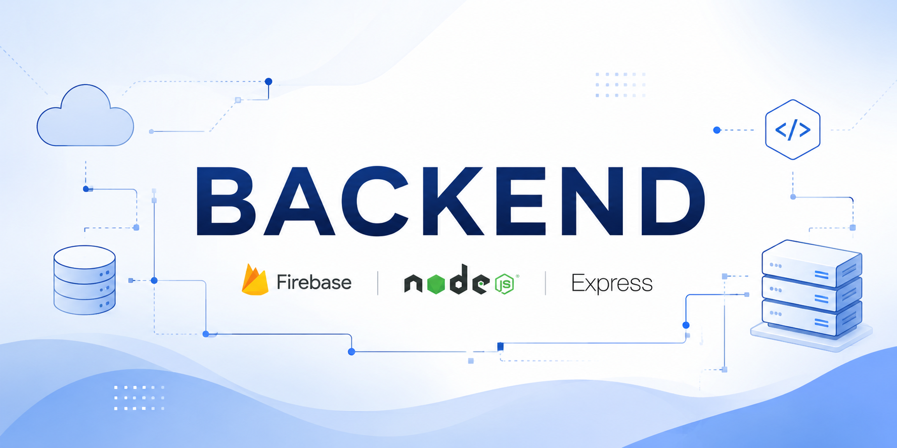

# Request Management API

A simple REST API built with Node.js, Express, and MongoDB for handling user requests and inquiries.

## Features

* Create new requests
* Retrieve all requests
* Retrieve a single request by ID
* Delete requests
* MongoDB integration using Mongoose
* Request validation
* Automatic timestamps (`createdAt` and `updatedAt`)

---

## Tech Stack

* Node.js
* Express.js
* MongoDB
* Mongoose

---

## Project Structure

```text
Project_1/
│
├── src/
|    ├── config/
│    |  ├──monogodb/
|    |  └──redis/
|    | 
|    ├── controllers/
│    |  └── request.controller.js
|    |
|    ├── model/
│    |  └── request.model.js
|    | 
|    ├── routes/
│    |  └── requestController.js
|    |       
|    └── server.js
│
├── .gitignore
├── Dockerfile
├── package.json
├── package-lock.json
└── README.md
```

---

## Request Schema

```js
{
  requestName: String,
  requestEmail: String,
  requestDetails: String,
  createdAt: Date,
  updatedAt: Date
}
```

### Validation

* `requestName` is required
* `requestEmail` is required
* Email format is validated
* `requestDetails` is optional

---

## API Endpoints

### Create Request

**POST** `/api/requests`

#### Request Body

```json
{
  "requestName": "Dennis Peprah",
  "requestEmail": "dennis@example.com",
  "requestDetails": "I need assistance with creating project cost estimation."
}
```

#### Response

```json
{
  "success": true,
  "message": "Request submitted successfully",
  "request": {}
}
```

---

### Get All Requests

**GET** `/api/requests`

#### Response

```json
{
  "success": true,
  "count": 1,
  "requests": []
}
```

---

### Get Single Request

**GET** `/api/requests/:id`

#### Response

```json
{
  "success": true,
  "request": {}
}
```

---

### Delete Request

**DELETE** `/api/requests/:id`

#### Response

```json
{
  "success": true,
  "message": "Request deleted successfully"
}
```

---

## Installation

Clone the repository:

```bash
git clone <repository-url>
cd <project-folder>
```

Install dependencies:

```bash
npm install
```

---

## Environment Variables

Create a `.env` file in the project root:

```env
PORT=5000
MONGODB_URI=your_mongodb_connection_string
```

---

## Running the Application

Development mode:

```bash
npm run dev
```

Production mode:

```bash
npm start
```

---

## Current Progress

### Completed

* Project initialization
* MongoDB connection setup
* Request model creation
* Request controller creation
* Request routes setup
* Request validation
* CRUD endpoints (Create, Read, Delete)
* Git repository setup

### Planned Improvements

* Update request endpoint
* Pagination
* Search and filtering
* Authentication and authorization
* Rate limiting
* API documentation using Swagger
* Unit and integration testing

---

## Author

Backend API built using Express and MongoDB.
